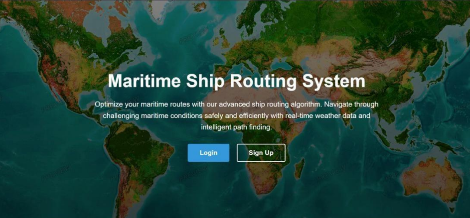
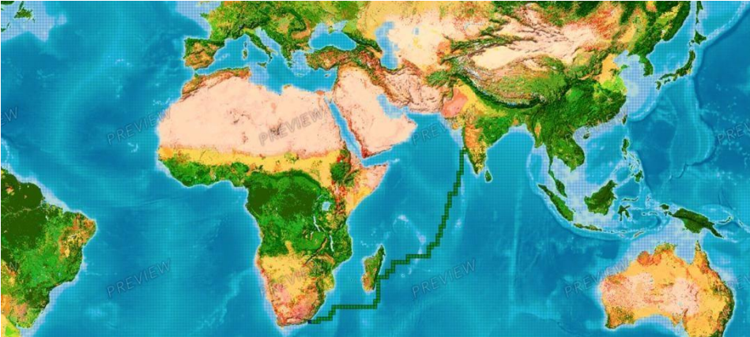
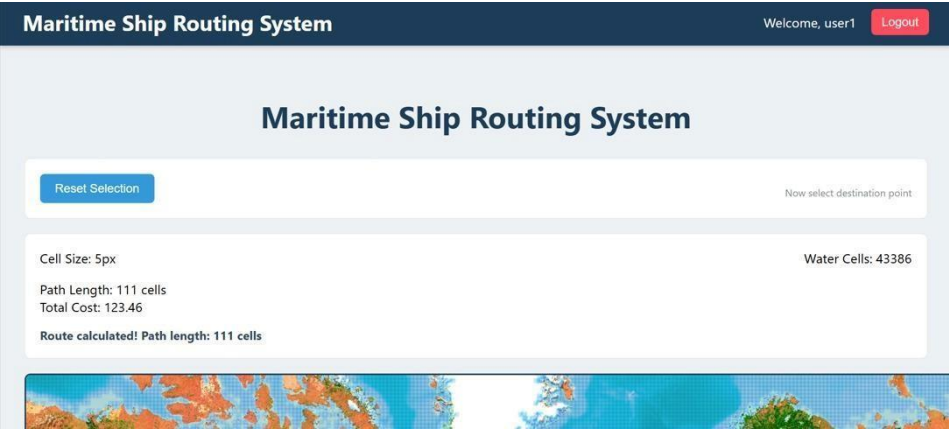

#  Visualization Of Dijkstra Algorithm

An intelligent maritime route optimization system that uses advanced algorithms and real-time weather data to determine safe and efficient shipping routes. Built with Django, GeoPandas, and a modified Dijkstra's algorithm enhanced with TOPSIS scoring.

---

## 🎯 Key Features

- **Modified Dijkstra's Algorithm**: Optimized pathfinding that considers dynamic weather conditions
- **TOPSIS-Based Grid Scoring**: Multi-criteria decision-making for evaluating ocean grid cells
- **Real-Time Weather Integration**: Dynamic weighting based on wind, waves, currents, and visibility (Uses Dummy data)
- **User Authentication**: Secure login and signup system
- **Route Analytics**: Display path statistics including total cost and cells traversed
- **Responsive Design**: Works seamlessly across browsers

---

## 🛠️ Technology Stack

| Category | Technologies |
|----------|--------------|
| **Backend** | Django, Python |
| **Database** | MySQL |
| **Frontend** | HTML5, CSS3 |
| **Libraries** | GeoPandas, NetworkX, NumPy |

---

## Prerequisites

- Python 3.8+
- MySQL 5.7+
- Modern web browser 

---

## Quick Start

### 1. Clone the Repository
```bash
git clone https://github.com/yourusername/maritime-ship-routing.git
cd maritime-ship-routing
```

### 2. Create Virtual Environment
```bash
python -m venv venv
source venv/bin/activate  # On Windows: venv\Scripts\activate
```

### 3. Install Dependencies
```bash
pip install django mysqlclient geopandas networkx numpy folium shapely
```

### 4. Database Setup
```bash
# Create MySQL database
mysql -u root -p
CREATE DATABASE ship_routing CHARACTER SET utf8mb4 COLLATE utf8mb4_unicode_ci;
```

### 5. Configure Django Settings
Update `ship_routing/settings.py`:
```python
DATABASES = {
    'default': {
        'ENGINE': 'django.db.backends.mysql',
        'NAME': 'ship_routing',
        'USER': 'your_username',
        'PASSWORD': 'your_password',
        'HOST': 'localhost',
        'PORT': '3306',
    }
}
```

### 6. Run Migrations
```bash
python manage.py makemigrations
python manage.py migrate
python manage.py runserver
```

### 7. Access Application
Navigate to `http://127.0.0.1:8000/` → Click "Initialize Database" → Sign up/Login → Start routing!

---

## 📸 Screenshots

### Landing Page
  
*Welcome screen with authentication options*

### Interactive Map Interface
  
*Click to select source and destination points*

### Route Calculation
  
*Optimized path with analytics and statistics*

---

## 🧮 How It Works

### 1. Grid-Based Ocean Modeling
- Ocean divided into grid cells with TOPSIS scores
- Each cell evaluated on 5 weather criteria

### 2. TOPSIS Scoring
Score = 1.0 + (0.25×wave + 0.20×wind + 0.20×current - 0.25×visibility + 0.10×precip)

Final Score ∈ [1.0, 10.0]

### 3. Dijkstra's Algorithm
- Builds graph with grid cells as nodes
- Edge weights = distance + (1/TOPSIS score)
- Finds path with minimum total cost

### 4. Path Smoothing
- Eliminates abrupt direction changes
- Produces realistic, navigable routes

---

---

## 🔧 Key Components

### GridCell Model
- Latitude & Longitude
- TOPSIS scores for: distance, weather risk, shipping density, depth
- Indexed for efficient queries

### Routing Engine (`routing.py`)
- `haversine()`: Great circle distance calculation
- `calculate_optimal_path()`: Core Dijkstra implementation
- Weather integration & weight calculation

### Web Interface
- Real-time form validation
- Dynamic route visualization

---
